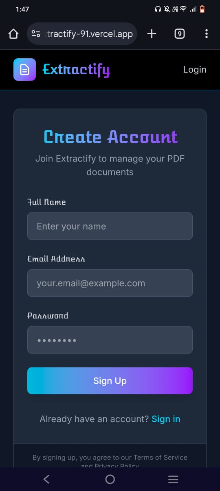
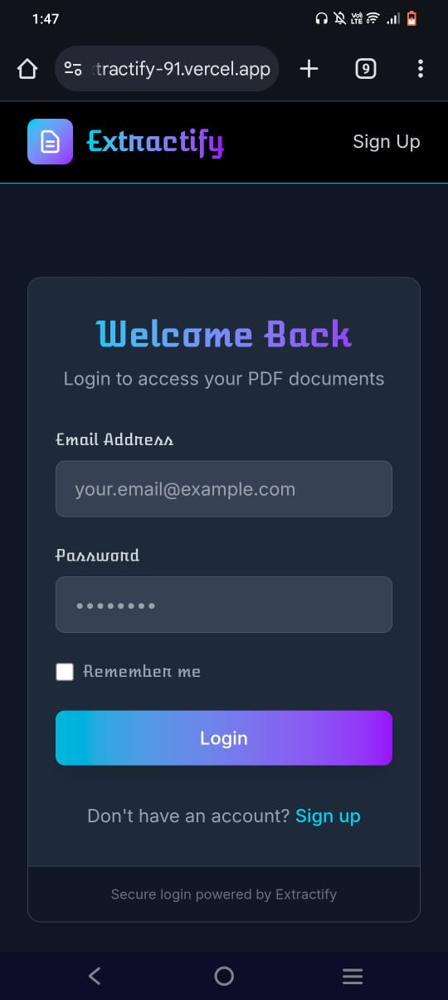
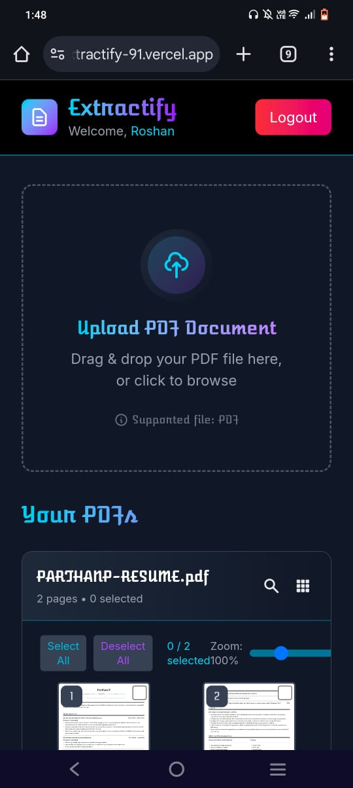
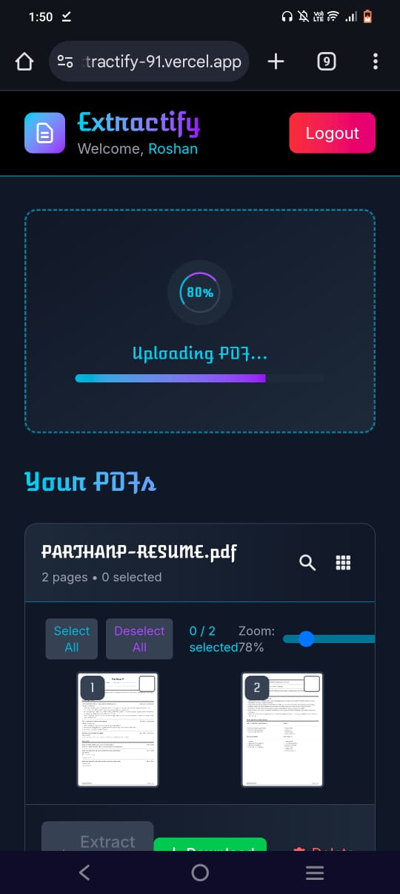
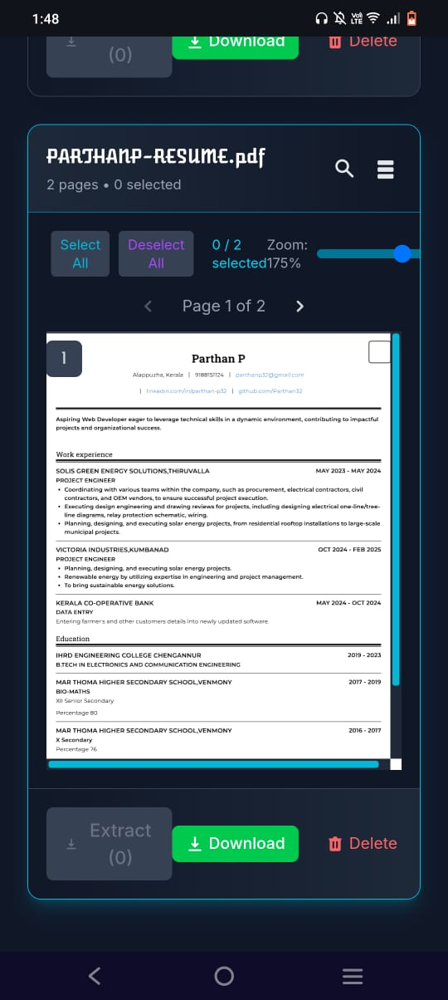
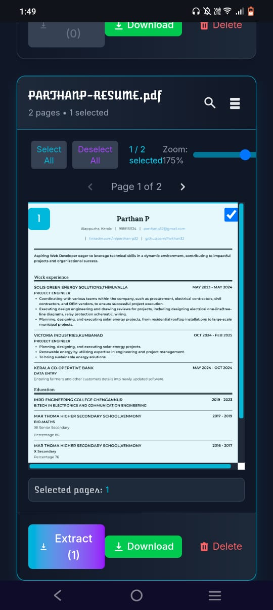
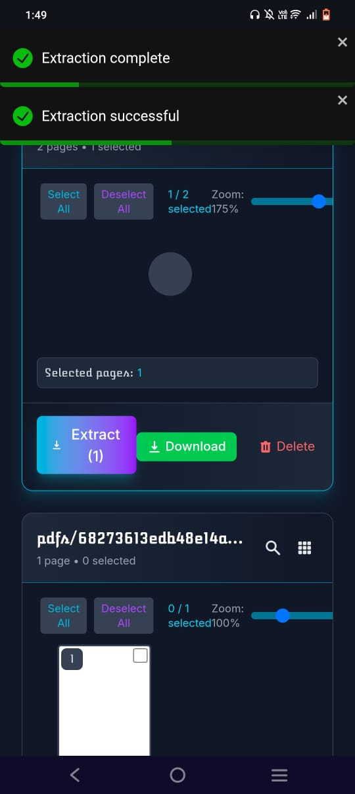
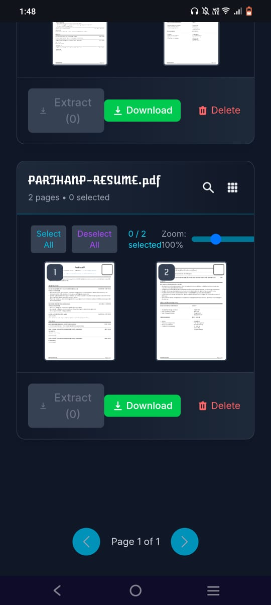

<head>
  <link href="https://fonts.googleapis.com/css2?family=Atomic+Age&display=swap" rel="stylesheet" />
  
</head>
<body>
  

    <h1>📑 Extractify</h1>
    
PDF Page Extractor Application

    
    
  

  

    <h2>Live Demo</h2>
    
Frontend: <a href="https://extractify-91.vercel.app">https://extractify-91.vercel.app</a>

    
Backend API: <a href="https://extractify-server.vercel.app">https://extractify-server.vercel.app</a>

  

  

    <h2>Overview</h2>
    <ul>
      <li>Upload secure PDFs</li>
      <li>View all pages of an uploaded PDF</li>
      <li>Select and reorder pages before extraction</li>
      <li>Download a newly generated PDF</li>
      <li>Delete unwanted PDFs</li>
      <li>Authenticated user management for document storage</li>
    </ul>
  

  

    <h2>Quick Start</h2>
    
Clone the Repository and change directory:

    <code>git clone https://github.com/Roshanbtech/Extractify.git &amp;&amp; cd Extractify</code>
    <h3>Backend</h3>
    <code>cd backend &amp;&amp; cp .env.example .env &amp;&amp; npm install &amp;&amp; npm run dev</code>
    <h3>Frontend</h3>
    <code>cd frontend &amp;&amp; npm install &amp;&amp; npm run dev</code>
    
Access the app at <a href="http://localhost:5173">http://localhost:5173</a>.

  

  

    <h2>Architecture &amp; Tech Stack</h2>
    
<strong>Frontend:</strong> React, Vite, TypeScript, Zustand, TailwindCSS

    
<strong>Backend:</strong> Express, TypeScript, MongoDB (Mongoose)

    
<strong>Storage:</strong> Cloudinary (authenticated storage)

    
<strong>PDF Processing:</strong> pdf-lib

    
<strong>Auth:</strong> JWT, bcrypt

    
<strong>Security &amp; Logging:</strong> Morgan, Helmet, CORS

    
<strong>Architecture:</strong> Clean/Hexagonal (Domain → Use Cases → Adapters)

  

  

    <h2>API Endpoints</h2>
    <h3>Authentication</h3>
    <ul>
      <li>POST <code>/api/auth/register</code> – User registration</li>
      <li>POST <code>/api/auth/login</code> – Returns JWT</li>
      <li>POST <code>/api/auth/logout</code> – Clears user session</li>
    </ul>

    <h3>PDF Operations</h3>
    <ul>
      <li>POST <code>/api/pdf/upload</code> – Upload a PDF (<em>multipart/form-data</em>, key <code>pdf</code>)</li>
      <li>GET <code>/api/pdf</code> – List all PDFs for user</li>
      <li>GET <code>/api/pdf/access/:publicId</code> – Get signed URL</li>
      <li>POST <code>/api/pdf/extract</code> – Extract &amp; create new PDF</li>
    </ul>

    
Authorization: <code>Authorization: Bearer &lt;token&gt;</code> header or cookie <code>accessToken</code>.

  

  

    <h2>Screenshots</h2>
    <table class="table-grid">
      <tr>
        <td></td>
        <td></td>
      </tr>
      <tr>
        <td></td>
        <td></td>
      </tr>
      <tr>
        <td></td>
        <td></td>
      </tr>
      <tr>
        <td colspan="2"></td>
        <td colspan="2"></td>
      </tr>
    </table>
  

  

    <h2>Testing</h2>
    
Use Postman or Insomnia:

    <ol>
      <li>Login to retrieve JWT</li>
      <li>Upload a PDF (<em>multipart/form-data</em>, key <code>pdf</code>)</li>
      <li>Extract pages by POSTing JSON to <code>/api/pdf/extract</code>:</li>
    </ol>
    <code>{ "publicId": "pdfs/USER_ID/original/my.pdf", "pages": [1,3,5], "order": [2,1,3] }</code>
  

  

    <h2>License</h2>
    
MIT • <a href="https://github.com/Roshanbtech">Roshanbtech</a>

  

</body>
